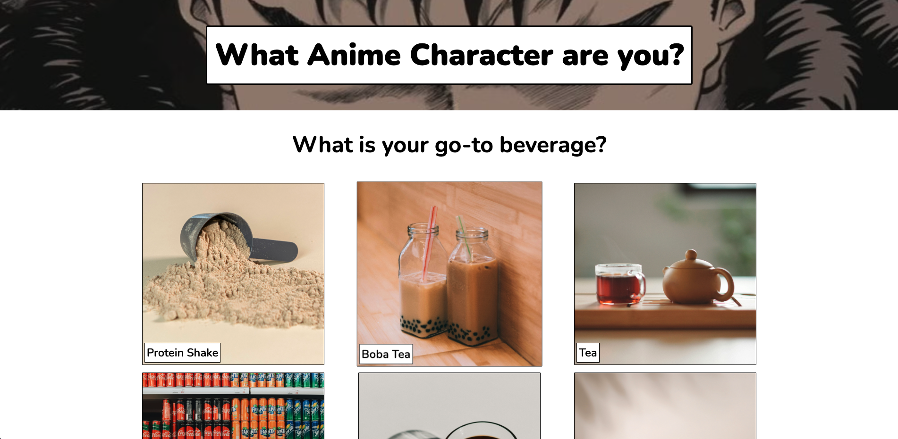
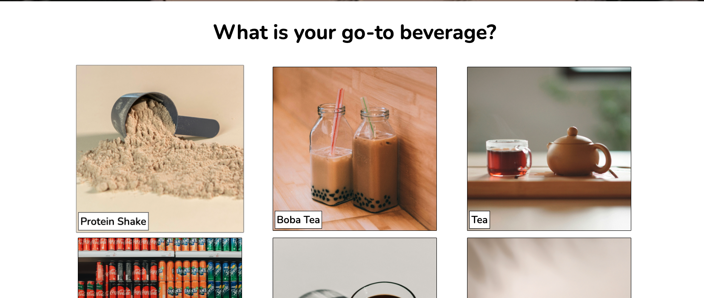
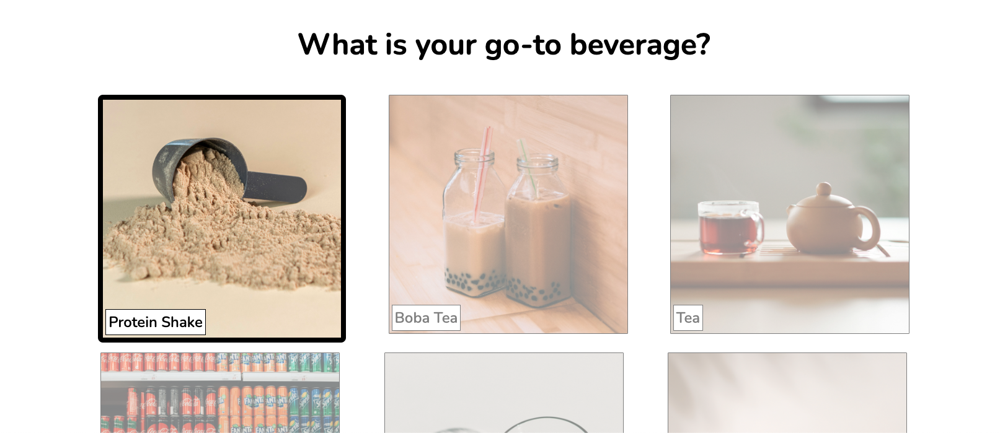
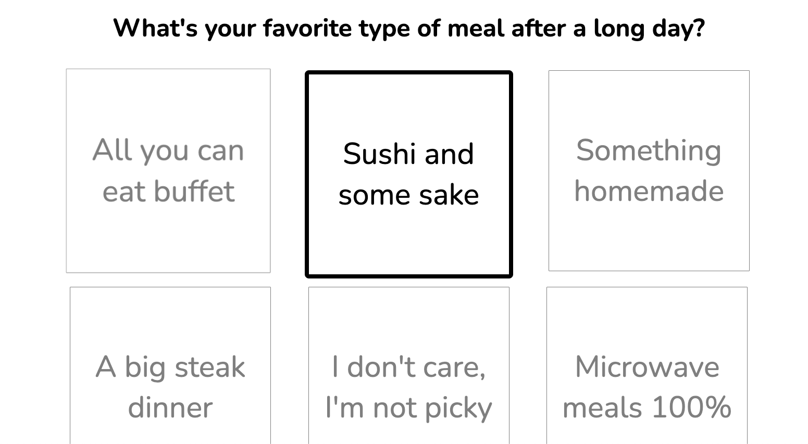
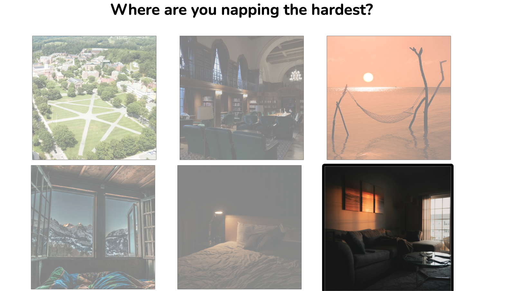
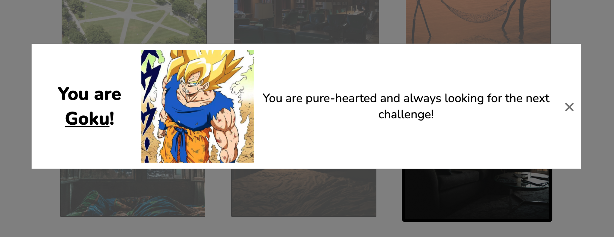

# Anime Character Buzzfeed style quiz

Buzzfeed-inspired quiz to find out what popular anime character somebody is based on their responses to the various questions. Animes include: 

1. Dragon Ball  -> Goku
2. JJK          -> Gojo
3. One Piece    -> Luffy
4. Demon Slayer -> Tanjiro
5. Berserk      -> Guts
6. Cowboy Bepop -> Spike

[deployed url](https://lab2-quiz-platform-rodillasjavier.onrender.com/)

## What Worked Well

Designing the page itself this time around went a lot more smoothly and quickly than with the lnading page. I already felt as though I was infinitely more comfortable with flex boxes and could pretty confidently know how to solve any layout issues I had. Also, sifting through the W3 documentation was very useful as I've never used JQuery before. 

## What Didn't

I had a really hard time making the generalized framework. I think that on the landing page, my mistakes in my html were exposed when I started CSS. This time I learned from my structuring mistakes because styling was super easy, since I knew more how to structure my page. This time around, however, in a way that is analogous to what happened in lab1, once I tried generalizing the framework for quizzes, I quickly realized the flaws in the way I structure my HTML and frequently had to go back and add or take away identifiers and classes. 

## Extra Credit

None applied

## Screenshots

 
 
 
 

## Design Spec (From Assignment Page)

*Note:* ~~strikethrough~~ indicates completion.

* **~~Questions:~~**
    * Display Several (3 or more) questions
    * Header image & some text
    * Have multiple potential answers

* **~~Question Answers:~~**
    * Be either (1) text or (2) image or (3) both
        * Text answers are clickable text boxes (not images or buttons)
        
    * 4 Potential display states
        * initial none selected
        * `:hover`
        * clicked/selected
        * not selected (different from non selected state)

* **~~Done Button:~~**
    * Calculate quiz output/results

* **~~Output Display:~~**
    * Text & image
    * Don't show unless calculations are finished
    * Display error if no all questions are answered